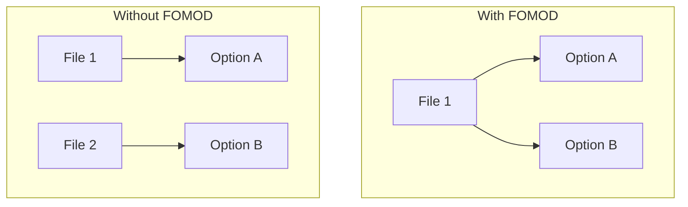

# Introduction

This documentation contains ideas and suggestions for a possible new next generation game agnostic mod installer format.

**NOTE:** the new format doesn't exist yet. It's currently just a mess of ideas that need to be written down, organized and formalized. If you wanna be involved, head over to [GitHub](https://github.com/erri120/NextModInstaller) or [Discord].

## What is a mod installer format?

> A mod installer format is a domain-specific language (DSL) that defines instructions, which mod managers use to correctly install the mod.

A format on it's own is pretty useless. It requires support and an implementation by mod managers to be useful.

## Why do we need mod installer formats?

Before we look at the reasons for why we need **another** format, let's start with why we need an installer format **at all**.

Some games are more difficult to mod than others. Take Darkest Dungeon and Knights of the Old Republic as an example. Modding Darkest Dungeon is extremely easy: you just download a mod and extract the contents into the right folder. The game is very open, every file is directly accessible and Darkest Dungeon barely uses complex or proprietary formats for its assets.

On the other hand, KotOR I and II, which use the Aurora Engine, are more complex because the game files are in complex formats. KotOR mods usually use the TSLPatcher because it can correctly modify the game files. TSLPatcher is both a format and an installer. Mods ship with the patcher executable and a `changes.ini` file. Authors only need to create the `changes.ini`, which the patcher executable reads to modify the game files.

Complex formats are often the reason why modding communities create specialized tools and installers. The Creation Engine used by Bethesda for TES and Fallout games has a custom plugin format `.esp`, a custom scripting language with Papyrus and even a custom archive format `.bsa`. For the community to create mods, these formats had to be reverse engineered and tools had to be created.

Another reason why installers exist is to provide **options/customization**. If you've modded Skyrim before, then I'm sure you've seen these types of prompts before:

- Do you want to install 1k, 2k or 4k textures?
- Select all patches you want to install.

For Skyrim, mods usually use the FOMOD (XML) format, which allows for multiple "steps" to be defined where the user can select different options. At the end, only the files the user wants are installed from the archive.

The FOMOD (XML) format is mostly used for "guided" installations where the user only downloads a single file which contains all the options instead of having multiple files that each contain a single option:



Interestingly, some FOMOD (XML) mods have been found in other games like Darkest Dungeon and S.T.A.L.K.E.R. simply to create a guided installation. The benefit of having a single file and a sort of "wizard" is clear: it's harder for the user to do something wrong.

## Why do we need another format?

[](https://xkcd.com/927/)

Here is a short non-exhaustive list of mod installer formats:

- FOMOD (XML)
- FOMOD (C#) for Fallout 3 and Fallout New Vegas
- OMOD (C# and OBMM Script) for Oblivion
- BAIN for Oblivion
- TSLPatcher for KotOR I and KotOR II
- MEM for Mass Effect

The only format on this list that is somewhat game agnostic is FOMOD (XML). The others are heavily specialized for their respective game. As such, we'll mostly look at FOMOD (XML), it's issues and why a new format is needed. Let's start with the **good**:

### FOMOD (XML): The Good

1) FOMOD (XML) allows mod authors to create a guided installation process for their users. This reduces the amount of RTFM/layer 8 issues, as it's now more difficult for the user to break the installation.
2) FOMOD (XML) is supported by popular mod managers like Mod Organizer 2 and Vortex.
3) FOMOD (XML) uses XML, which is a great format.

The first two points are the reason why FOMOD (XML) has been seen in other communities like Darkest Dungeon, Cyberpunk 2077 and S.T.A.L.K.E.R. The format has been adopted widely and provides an easy way to present options to the user.

I hope you're not surprised by the fact that the list of good points is already over.

### FOMOD (XML): The Bad

#### Where is the Standard?

For a format this popular, it must have some sort of spec or standard, right? Well, if you look things up you'll find the [fomod Documentation](https://fomod-docs.readthedocs.io/en/latest/index.html) which contains a [Specification](https://fomod-docs.readthedocs.io/en/latest/specs.html) section. Let's read some parts from it:

> The fomod format initially arose from the need to provide users with a simpler way of installing mods without the need to download multiple files.

Yup, we already mentioned this in the "good parts" section. This is one of the things FOMOD (XML) generally does pretty well.

> It was created and initially maintaned by a currently unknown developer.

Aside from the typo, I want to draw attention to the website itself. You can find the source code on GitHub in the [GandaG/fomod-docs](https://github.com/GandaG/fomod-docs) repository. This repo was created in 2017 and hasn't been touched since. The author of the website [GandaG](https://github.com/GandaG) has been a great help to the community and created some awesome FOMOD (XML) related projects like [fomod-validator](https://github.com/GandaG/fomod-validator), [pyfomod](https://github.com/GandaG/pyfomod), the docs we're currently looking at, the new archived [fomod-designer](https://github.com/GandaG/fomod-designer) and more.

They took the time to understand an almost obscure format and create useful tools and docs for it. This is something I appreciate greatly, as I've done the same with [OMOD](https://github.com/erri120/OMOD-Framework), [twice](https://github.com/erri120/OMODFramework) (yes, I hate my life).

This is sadly typical for modding related projects and open-source projects. The author creates something cool in their free time, then leaves the community and now the historians have to figure out what the hell is going on.

Let's continue reading:

> Info File
>
> There is no defined schema for this file but it is required anyway. A proposed schema to fit the majority of mod managers could be: [...]

> Config File
>
> You can find a complete reference for this file here. However, since it is generally easier to understand, it is recommended that you look through the actual schema.

The `info.xml` file, which is required, has no defined schema. However, the `ModuleConfig.xml` file has one, which you can find [here](https://github.com/GandaG/fomod-schema/blob/master/ModuleConfig.xsd).

I already mentioned that the website was created in 2017, meaning that it isn't that old. I want to draw attention to [this GitHub issue](https://github.com/GandaG/fomod-docs/issues/2) and some of it's comments:

> The problem with not having a standard is that... there's no standard. So each mod manager can do it their own way. AFAIK, Mod Organizer 2's installer merges the result (I'm not very fluent in C++) and Wrye Bash's upcoming installer completely overrides the losing folder.

This is by far the biggest reason to create a new mod installer format: **FOMOD (XML) doesn't have a standard**. Every mod manager just wings their own implementation and has to work with ancient mods that don't necessarily conform to anything.

I applaud [GandaG](https://github.com/GandaG) and all other community members for trying to improve this wreck somehow, but we, the community as a whole, should look for a new mod installer format.

For the sake of discussion, let's assume that FOMOD (XML) has a standard and that every mod installer implements it correctly. What else is bad about the format?

#### Is it game agnostic?

FOMOD (XML) mods have been seen in communities outside of the usual Bethesda community. While it can be used for different games, is it truly game agnostic?

Sadly, the format wasn't created to be game agnostic. Instead, it was created for Fallout games initially and then people realized it doesn't contain many Bethesda specific things. Let's take a look at this example from the [kryptopyr's Patch Hub](https://www.nexusmods.com/skyrimspecialedition/mods/19518?tab=files) version 3.4:

```xml
<plugin name="WACCF - Weapons Armor Clothing and Clutter Fixes">
    <description>Install patches for Weapons Armor Clothing and Clutter Fixes.</description>
    <image path="fomod\images\waccf.jpeg" />
    <conditionFlags>
        <flag name="hasWACCF">On</flag>
    </conditionFlags>
    <typeDescriptor>
        <dependencyType>
            <defaultType name="Optional"/>
            <patterns>
                <pattern>
                    <dependencies operator="And">
                        <fileDependency file="Weapons Armor Clothing &#38; Clutter Fixes.esp" state="Active"/>
                    </dependencies>
                    <type name="Recommended"/>
                </pattern>
            </patterns>
        </dependencyType>
    </typeDescriptor>
</plugin>
```

First, `plugin` is a Bethesda specific term, however, a FOMOD (XML) plugin doesn't describe a Bethesda plugin file (`.esp`). Instead, it's an **option** users can select from a group of options. Aside from this weird name, I want to draw attention to the `fileDependency` element:

```xml
<fileDependency file="Weapons Armor Clothing &#38; Clutter Fixes.esp" state="Active"/>
```

This directly references a Bethesda plugin files and requires the plugin to be considered "Active". Bethesda plugins can be enabled and disabled, so this is a direct reference to a Bethesda specific concept.

Another reason I don't consider FOMOD (XML) to be game agnostic, is because it can't be extended for game specific concepts. A game agnostic mod installer format should have game agnostic elements like options for the user, but it should also allow for game specific concepts to be implemented. Take the TSLPatcher as an example, the `changes.ini` file required to make a TSLPatcher work could very well be converted into a FOMOD (XML) if the format could be extended.

#### Dependencies and Versions

Once again, I'm using [kryptopyr's Patch Hub](https://www.nexusmods.com/skyrimspecialedition/mods/19518?tab=files) version 3.4 for my examples. This patch hub contains a massive `ModuleConfig.xml` file that allows users to select patches for the mods they have installed. Let's take a look at how this works:

```xml
<plugin name="CACO - Complete Alchemy and Cooking Overhaul">
    <description>Install patches for Complete Alchemy and Cooking Overhaul.</description>
    <image path="fomod\images\caco.jpeg" />
    <conditionFlags>
        <flag name="hasCACO">On</flag>
    </conditionFlags>
    <typeDescriptor>
        <dependencyType>
            <defaultType name="Optional"/>
            <patterns>
                <pattern>
                    <dependencies operator="And">
                        <fileDependency file="Complete Alchemy &#38; Cooking Overhaul.esp" state="Active"/>
                    </dependencies>
                    <type name="Recommended"/>
                </pattern>
            </patterns>
        </dependencyType>
    </typeDescriptor>
</plugin>
```

First, we have a step that checks if you have the mod "Complete Alchemy and Cooking Overhaul" installed. This is done using the `fileDependency` element we looked at before and it requires the `Complete Alchemy & Cooking Overhaul.esp` plugin to be active. If that is the case, the flag `hasCACO` is set to `On` and we continue to the next step.

Next, we have a step that is only active if `hasCACO` is set to `On`:

```xml
<installStep name="Complete Alchemy and Cooking Overhaul">
    <visible>
        <dependencies operator="And">
            <flagDependency flag="hasCACO" value="On"/>
        </dependencies>
    </visible>
    <!-- rest omitted -->
</installStep>
```

Inside this step, we can choose and install patches for mods that might be incompatible with "Complete Alchemy and Cooking Overhaul":

```xml
<plugin name="Bittercup">
    <description>Compatibility patch for Bittercup (Creation Club) and CACO. Patch by Monops. ESL-flagged.</description>
    <image path="fomod\images\CC-Bittercup.jpg" />
    <files>
        <folder source="caco\Bittercup (CC)" destination="" priority="0" />
        <file source="fomod\readmes\CACO\Bittercup (CC).txt" destination="Docs - kryptopyr's patches\CACO\Bittercup (CC).txt" priority="0" />
    </files>
    <typeDescriptor>
        <dependencyType>
            <defaultType name="Optional"/>
            <patterns>
                <pattern>
                    <dependencies operator="And">
                        <fileDependency file="cckrtsse001_altar.esl" state="Active"/>
                    </dependencies>
                    <type name="Recommended"/>
                </pattern>
            </patterns>
        </dependencyType>
    </typeDescriptor>
</plugin>
```

Here we have a compatibility check that uses `fileDependency` again to check if `cckrtsse001_altar.esl` is active.

Dependencies are purely file based. Either you have the file installed, or you don't. This file based approach is very basic and falls apart quickly, especially for patches. The issue this represents is that any mod can provide the file. You can't describe the exact mod that is required. Additionally, you also can't specify the version or a range of versions. Maybe your patch only works for versions between `1.0.0` and `2.0.0`?

The version and dependency dilemma can also partly be blamed on mod hosting sites. You can't express dependencies in FOMOD (XML) and on hosting sites like Nexus Mods using versions. You can't be exact because you only have the most basic tool to work with.

Ironically, a completely different community has somewhat solved this dependency issue while still using files. On Linux when you write C/C++ libraries and you want to link with another library, the compiled `.so` files are versioned:

- `libzstd.so`
- `libzstd.so.1`
- `libzstd.so.1.5.5`

This allows anyone to link to all versions, a specific major version, or a specific complete version of a library. However, it should be noted that `libzstd.so` is symlinked to `libzstd.so.1` which is symlinked to `libzstd.so.1.5.5`. You don't have three different files, you have a single file that is available at three different paths.

Aside from a file dependency, it's also not possible to have a requirement on a specific game, game edition or game version. Skyrim has multiple different editions and versions and compatibility can be very different across them. FOMOD doesn't offer this capability, which results in mod pages having different files for each game version or a single FOMOD where the user has to select the correct version.

#### Archives, Paths and Images

FOMOD (XML) doesn't care what archive is used for packaging. You mostly find ZIP archives but sometimes also 7z archives that contain FOMOD (XML) files. While this isn't inherently an issue, it requires mod managers to support any archive if they want to support this format.

Additionally, paths are differently encoded depending on the archive. [kryptopyr's Patch Hub](https://www.nexusmods.com/skyrimspecialedition/mods/19518?tab=files) version 3.4 came in a `.zip` file, which stores file names using forward slashes `/`. However, inside the FOMOD (XML) you find that they use backwards slashes:

```xml
<image path="fomod\images\waccf.jpeg" />
```

In this example we see another issue. The image points to a JPEG. But can you also use a PNG, or a WEBP? What about AVIF or JPEG XL? None of this is defined anywhere. This leaves mod managers wondering how they should implement this format. Similar to archives, they have to support everything because anything can come in.

### FOMOD (XML): The Ugly

Let's finish this up with a short rant.

The format is named **FOMOD**. I explicitly used the term `FOMOD (XML)` to refer to the exact format. `FOMOD (XML)` and `FOMOD (C#)` are two different formats that have **the same name**. Not only that, they both have `FO` in the name which stands for **FALLOUT**, or "fuck off" depending on who you ask. This name has been the bane for many users and mod authors. Try explaining to a user that Skyrim mods use the FOMOD format which is different from the original FOMOD format created by FOMM for Fallout 3 and Fallout New Vegas which carries similarities to OMOD since the same team behind OBMM also made FOMM.

## Conclusion

This page hopefully made it clear why we need a new mod installer format. If you have any questions or want to discuss stuff, head over to the [GitHub](https://github.com/erri120/NextModInstaller) page or contact me on [Discord].

[Discord]: https://discord.gg/nexusmods
